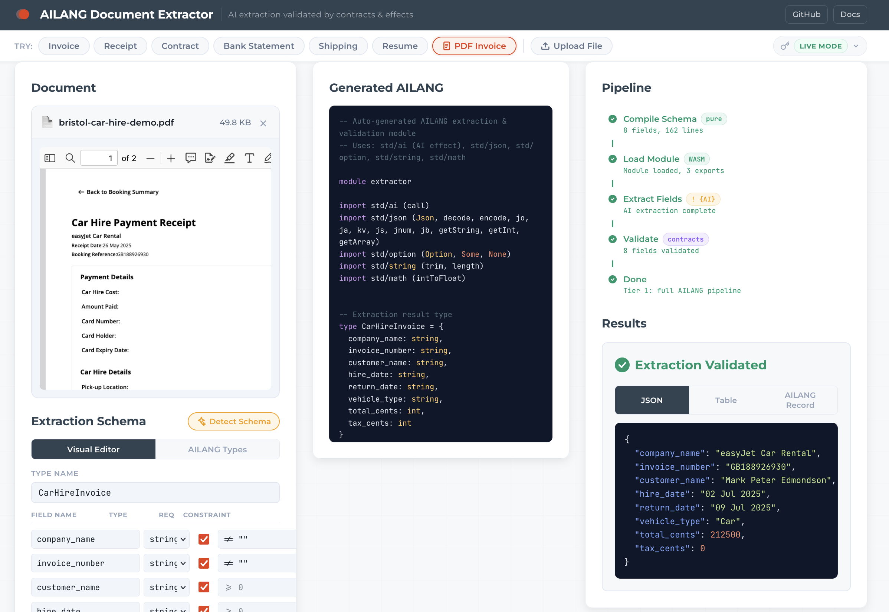
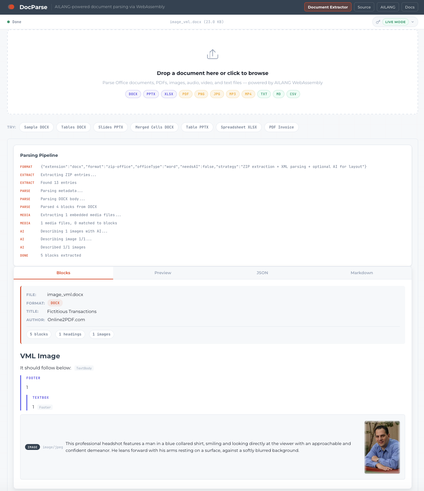

# AILANG Demos

Vertical demos showcasing [AILANG](https://ailang.sunholo.com/) — a pure functional programming language with Hindley-Milner type inference, algebraic effects, and first-class AI capabilities.

## Demos

| Demo | Description | Features |
|------|-------------|----------|
| [Document Extractor](invoice_processor_wasm/) | AI-powered document extraction validated by AILANG contracts via WebAssembly — live on GitHub Pages | AI effect, contracts, std/json, multimodal (PDF/images), capability security, WASM |
| [DocParse](docparse/) | Universal document parsing — DOCX, PPTX, XLSX, PDF, images to structured JSON and markdown | std/xml, ADTs, contracts, pure functions, AI self-healing, WASM |
| [Ecommerce](ecommerce/) | AI recommendations, data pipelines, BigQuery analytics, contracts, REST API + React UI | AI effect, capability budgets, OAuth2, REST API, serve-api, inline tests, requires/ensures |

## Demo Showcase

### Document Extractor

Upload any document — text, image, or PDF — define a schema (or let AI detect one), and get validated, type-safe extraction results. **100% local, 100% AI-coded.** Nothing leaves your browser except the API call to the AI provider — and the provider is swappable via AILANG's `! {AI}` effect system.

**[Try it live →](https://sunholo-data.github.io/ailang-demos/)**



**Features:** 7 demo presets (invoice, receipt, contract, bank statement, shipping label, resume, PDF invoice), AI schema detection, multimodal file upload (images + PDFs), real-time pipeline visualization, 3-tier graceful degradation, generated AILANG code view. AILANG validates every AI extraction result with contracts and type-safe JSON parsing — deterministic validation of stochastic AI output.

### DocParse

Drop a DOCX, PPTX, XLSX, PDF, or image and get structured output — headings, tables (with merged cells), images, text boxes, and more. 8 AI-generated AILANG modules parse Office XML directly in WebAssembly via `std/xml`. No server, no heavy dependencies. 28 contracts, 17 real-world test files, all pure functions.

**[Try DocParse →](https://sunholo-data.github.io/ailang-demos/docparse.html)**



**Features:** DOCX/PPTX/XLSX deterministic XML parsing, PDF and image AI extraction, merged cell handling, AI image descriptions, AI self-healing for ambiguous tables, 4 output views (blocks, preview, JSON, markdown), copy-to-clipboard, Block ADT with pattern matching. Integrates with Document Extractor for end-to-end extraction pipelines.

### Ecommerce

Six working demos covering AI integration, data pipelines, capability budgets, BigQuery analytics, design-by-contract verification, and a REST API with React UI.


**Features:** Contract verification forms, live BigQuery analytics with charts, AI-powered product recommendations, server status monitoring, and zero-code API generation from AILANG modules.

## Install AILANG

**Claude Code:**
```
/plugin marketplace add sunholo-data/ailang_bootstrap
/plugin install ailang
```

**Gemini CLI:**
```
gemini extensions install https://github.com/sunholo-data/ailang_bootstrap.git
```

See [ailang.sunholo.com](https://ailang.sunholo.com/) for full docs.

## What is AILANG?

AILANG is a pure functional language designed for AI-native applications:

- **Hindley-Milner type inference** — types are inferred, not annotated
- **Algebraic effects** — controlled side effects via capabilities (`IO`, `FS`, `Net`, `AI`)
- **Capability budgets** — hard limits on resource usage with `@limit=N`
- **Pattern matching** — on lists, `Option`, `Result`, and custom ADTs
- **First-class AI** — `std/ai` effect for calling any AI provider
- **Contracts** — `requires`/`ensures` preconditions and postconditions
- **WebAssembly** — run AILANG in the browser with full stdlib support

## Repository Structure

```
demos/
├── invoice_processor_wasm/   # Document Extractor + DocParse (WASM, GitHub Pages)
│   ├── index.html            # Document Extractor — 3-column pipeline layout
│   ├── docparse.html         # DocParse — drag-and-drop document parser
│   ├── js/                   # Pipeline orchestrators, Gemini client, schema compiler
│   ├── css/                  # Sunholo design system
│   ├── assets/               # Screenshots, demo files
│   └── wasm/                 # AILANG WASM binary (downloaded by CI)
├── docparse/                 # DocParse AILANG source (8 modules)
│   ├── main.ail              # Entry point, CLI args, format routing
│   ├── types/document.ail    # Block ADT, TableCell, metadata types
│   ├── services/             # Format parsers, AI, output formatter
│   └── data/test_files/      # 17 real-world test files
├── ecommerce/                # Ecommerce vertical demo
│   ├── main.ail              # AI product recommendations
│   ├── pipeline_runner.ail   # Data pipeline
│   ├── trusted_analytics_demo.ail  # Budget-as-contract
│   ├── bigquery_demo.ail     # BigQuery GA4 analytics
│   ├── contracts_demo.ail    # Design-by-contract verification
│   ├── ui/                   # React dashboard (serve-api frontend)
│   └── services/             # Shared services (auth, BigQuery, AI)
└── models.yml                # AI model configuration
```

## References

- [Document Extractor — Live Demo](https://sunholo-data.github.io/ailang-demos/)
- [DocParse — Live Demo](https://sunholo-data.github.io/ailang-demos/docparse.html)
- [Demo Source Code](https://github.com/sunholo-data/ailang-demos)
- [AILANG Documentation](https://ailang.sunholo.com/)
- [AILANG Source](https://github.com/sunholo-data/ailang)
