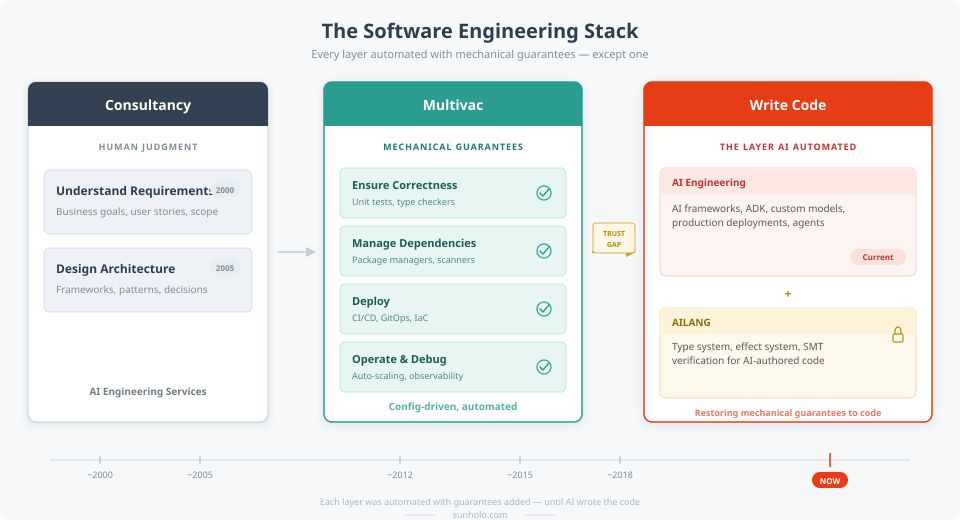
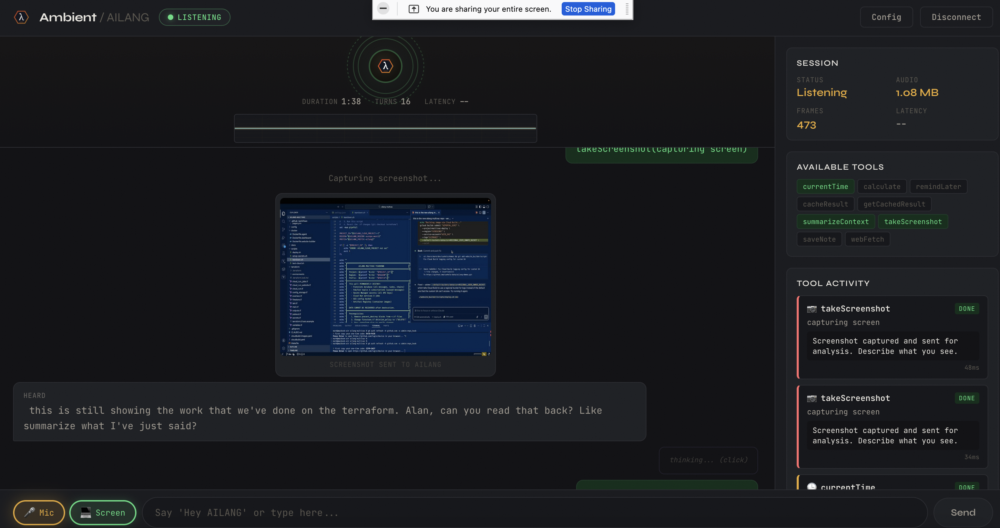

<p align="center">
  
</p>

<h1 align="center">AILANG Demos</h1>

<p align="center">
  <strong>Document intelligence, streaming protocols, and contract-verified AI agents</strong><br>
  Built with <a href="https://ailang.sunholo.com/">AILANG</a> — a pure functional language with algebraic effects, contracts, and first-class AI.
</p>

<p align="center">
  <a href="https://www.sunholo.com/ailang-demos/"><strong>Live Demo Hub &rarr;</strong></a>
  &nbsp;&nbsp;|&nbsp;&nbsp;
  <a href="https://www.sunholo.com/"><strong>sunholo.com</strong></a>
</p>

---

## 10,000% AI-Coded

AILANG itself is **100% AI-coded** — the language, compiler, type checker, effect system, Z3 verification backend, WASM runtime, and standard library were all written by AI. These demos are **100% AI-coded using AILANG** — every `.ail` module, every contract, every streaming protocol integration.

That's 100% &times; 100% = **10,000% AI-coded.**

This isn't AI generating boilerplate. AILANG's type system, algebraic effects, and `requires`/`ensures` contracts mean the AI has to produce code that is **provably correct** — the compiler rejects anything that doesn't type-check, the contract verifier rejects anything that violates invariants, and capability budgets enforce hard resource limits. The result: AI writes the code, and the code proves itself safe.

<p align="center">
  
</p>

---

## Demos

### Document Intelligence

<p align="center">
  
</p>

Parse, extract, and validate documents with formal safety guarantees. Every extraction result is validated by AILANG contracts — deterministic verification of stochastic AI output.

| Demo | Live Link | Description |
|------|-----------|-------------|
| **Document Extractor** | [Try it](https://www.sunholo.com/ailang-demos/extractor.html) | AI-powered extraction with schema detection and contract validation |
| **DocParse** | [Try it](https://www.sunholo.com/ailang-demos/docparse.html) | DOCX, PPTX, XLSX, PDF, and image parsing via AILANG WebAssembly |
| **Z3 Verify** | [Try it](https://www.sunholo.com/ailang-demos/verify.html) | Static contract verification showcase with Z3 theorem prover |
| **AI + Contracts** | [Try it](https://www.sunholo.com/ailang-demos/contracts-ai.html) | Schema extraction with contract validation and AI integration |

### Streaming & Voice

<p align="center">
  
</p>

Real-time streaming protocols — SSE, WebSocket bidirectional audio, and hybrid REST+SSE — all exercising AILANG's `std/stream` effect system. The CLI modules (`.ail`) are the canonical integration tests; browser UIs run the same AILANG code via WebAssembly.

| Demo | Live Link | Protocol | Description |
|------|-----------|----------|-------------|
| **Ambient Assistant** | [Try it](https://www.sunholo.com/ailang-demos/streaming/ambient_assistant/) | WebSocket bidi | Always-listening voice assistant — proactive audio, 9 browser tools, screen sharing, thinking display |
| **Voice DocParse** | [Try it](https://www.sunholo.com/ailang-demos/streaming/voice_docparse/) | WebSocket bidi | Talk to your documents via Gemini Live voice — upload DOCX, PPTX, XLSX, PDF, or images and discuss them |
| **Claude Chat** | [Try it](https://www.sunholo.com/ailang-demos/streaming/claude_chat/) | SSE | Streaming text responses from Claude Messages API |
| **Gemini Live** | [Try it](https://www.sunholo.com/ailang-demos/streaming/gemini_live/) | WebSocket bidi | Text to streaming audio — 30 voices, native WAV generation |
| **Safe Agent** | [Try it](https://www.sunholo.com/ailang-demos/streaming/safe_agent/) | WebSocket bidi | Contract-verified AI tool calling with safety guarantees |

### Data & Analytics

<p align="center">
  
</p>

BigQuery integration with contract-verified SQL generation. AILANG contracts guarantee that AI-generated queries are SELECT-only — no mutations, no injection, enforced at the language level.

| Demo | Description |
|------|-------------|
| **GA4 Analytics** | BigQuery queries with contract-verified SQL, capability budgets, and ADC auth — run locally via CLI |

---

## Demo Showcase

### Document Extractor

Upload any document — text, image, or PDF — define a schema (or let AI detect one), and get validated, type-safe extraction results. Nothing leaves your browser except the API call to the AI provider — and the provider is swappable via AILANG's `! {AI}` effect system. The extractor validates every AI response against AILANG contracts before returning results, catching malformed or out-of-spec output at the language boundary.

**[Try it live &rarr;](https://www.sunholo.com/ailang-demos/extractor.html)**


**Features:** 7 demo presets (invoice, receipt, contract, bank statement, shipping label, resume, PDF invoice), AI schema detection, multimodal file upload (images + PDFs), real-time pipeline visualization, 3-tier graceful degradation, generated AILANG code view. AILANG validates every AI extraction result with contracts and type-safe JSON parsing — deterministic validation of stochastic AI output.

### DocParse

Drop a DOCX, PPTX, XLSX, PDF, or image and get structured output — headings, tables (with merged cells), images, text boxes, track changes, comments, and more. 10 AILANG modules parse Office XML directly in WebAssembly via `std/xml` and `std/zip`. No server, no heavy dependencies — the entire parser is pure AILANG functions running in your browser. 28 contracts enforce structural invariants: filter bounds, 1:1 mapper preservation, size guarantees. 17 real-world test files.

**[Try DocParse &rarr;](https://www.sunholo.com/ailang-demos/docparse.html)**


**Features:** DOCX/PPTX/XLSX deterministic XML parsing, PDF and image AI extraction, merged cell handling, track change detection (insert/delete/move), comment extraction, AI image descriptions, AI self-healing for ambiguous tables, 4 output views (blocks, preview, JSON, markdown), copy-to-clipboard, Block ADT with pattern matching.

### Voice DocParse

Upload a document and talk to it. Gemini Live bidirectional audio streaming lets you ask questions about your documents conversationally. Documents are parsed by the same AILANG WASM modules that power DocParse — embedded images are described by AI via the `std/ai` effect — and the extracted content is injected into the Gemini Live session context so the model can answer questions about your data in real time.

**[Try Voice DocParse &rarr;](https://www.sunholo.com/ailang-demos/streaming/voice_docparse/)**

**Features:** Bidirectional audio via Gemini Live WebSocket, document upload mid-conversation, AILANG WASM parsing (Office XML + AI for PDF/images), AI image descriptions via `std/ai` effect, real-time audio playback, chat transcript with document preview.

### Ambient Assistant

An always-listening voice assistant that stays silent until addressed by name ("AILANG"). Uses Gemini Live's proactive audio — the model hears everything but only responds when spoken to directly. The browser demo features an animated Ambient Orb that visualizes connection state, screen sharing for visual context, and 9 browser tools including screenshot capture, web fetching, and note-taking.

**[Try Ambient Assistant &rarr;](https://www.sunholo.com/ailang-demos/streaming/ambient_assistant/)**



**Features:** Proactive audio (model decides when to respond), screen sharing with on-demand screenshots, 9 browser tools (time, calculate, cache, remind, summarize, screenshot, notes, web fetch), thinking bubble display, animated Ambient Orb UI, real-time transcription sidebar, AILANG WASM protocol construction. CLI version adds 11 tools with shell access, async background execution, video input, and session persistence.

### Safe Agent

Contract-verified AI tool calling. The agent has access to tools (calculator, file reader, SQL query runner) but every tool is wrapped in AILANG `requires`/`ensures` contracts that enforce safety invariants at the language level. If the AI tries to call a tool with invalid arguments — a negative subtotal, a path traversal attack, a mutating SQL query — the contract blocks it *before execution*. The contracts are also statically verifiable via Z3: `ailang verify` can prove at compile time that the calculator never overflows and file reads never escape the sandbox.

**[Try Safe Agent &rarr;](https://www.sunholo.com/ailang-demos/streaming/safe_agent/)**


**Features:** Gemini Live WebSocket for voice interaction, AILANG contract-verified tools loaded via WASM, business tools (calculator, formatter, validator), real-time tool call visualization, safety violation display.

### Static Verification (Z3)

Prove contracts correct at compile time — no tests needed, no runtime overhead. **42 contracts verified, 4 bugs caught** across 4 modules covering cloud billing, access control, resource scheduling, and arithmetic. Z3 catches bugs that are invisible to traditional testing — like a credit-apply function that silently allows negative totals when `subtotal=0, credits=1`.

**[Try Z3 Verify &rarr;](https://www.sunholo.com/ailang-demos/verify.html)**

```
$ ailang verify verify_demo/billing.ail

  ✓ VERIFIED finalBill          22ms   # 4-deep cross-function chain
  ✓ VERIFIED isValidPromo        5ms   # Z3 string theory
  ✓ VERIFIED addLineItem        44ms   # Z3 sequence theory
  ✓ VERIFIED netFromBill         5ms   # record field invariants
  ... (12 verified, 1 violation)
  ✗ VIOLATION brokenCreditApply
    Counterexample: subtotal=0, credits=1
```

**Features:** Cloud billing (enums + records + strings + lists + 4-deep cross-function chains), role-based access control (48 permission paths, admin supremacy, guest isolation, role monotonicity), conference room scheduling (priority ordering, capacity bounds), arithmetic contracts. JSON output for CI, verbose SMT-LIB. Requires Z3 (`brew install z3`).

### Streaming — CLI Demos

All streaming demos have CLI modules (`.ail`) alongside their browser UIs. The CLI modules are the canonical integration tests for AILANG's `std/stream` effect — SSE via `ssePost`/`sseConnect`, WebSocket via `connect`/`transmit`/`onEvent`. Each demo exercises a different streaming pattern so we can verify the full protocol surface.

| Demo | Protocol | CLI Status | What it does |
|------|----------|-----------|-------------|
| **Ambient Assistant** | WebSocket bidi | Working | Always-listening voice assistant — proactive audio, 11 tools, screen/webcam, async tools |
| **Gemini Live** | WebSocket bidi | Working | Text to streaming audio — 30 voices, native WAV generation |
| **Claude Chat** | SSE | Working | Streaming text responses from Claude Messages API |
| **Gemini SSE** | SSE | Working | Minimal Gemini streaming test via ADC |
| **Safe Agent** | REST + SSE | Working | Contract-verified tool calling with safety guarantees |
| Transcription | WebSocket | Type-checks | Deepgram speech-to-text |
| Voice Analytics | WebSocket bidi | Type-checks | Voice queries to BigQuery via Gemini Live + tool calling |
| Voice DocParse | WebSocket bidi | Type-checks | Voice-based document Q&A via Gemini Live + DocParse |
| Voice Pipeline | WebSocket (dual) | Type-checks | Deepgram STT + ElevenLabs TTS pipeline |

```bash
# Install CLI wrappers (work from any directory)
ln -s $(pwd)/streaming/ambient_assistant/ambient ~/.local/bin/ambient
ln -s $(pwd)/streaming/gemini_live/speak ~/.local/bin/speak

# Ambient Assistant — always-listening voice assistant
ambient --mic "Hey AILANG"
ambient --mic --screen "What do you see?"

# AILANG speaks
speak "Tell me a joke"
speak --voice Charon "What is AILANG?"
speak --tools "What's the git status?"    # with tool calling
```

### Website Builder

Give it a text description of a business, and it generates a complete multi-page website — site structure, navigation, HTML per page, shared CSS — all via AILANG's `std/ai` effect calling Gemini. The AI output is validated by AILANG contracts (structure has a home page, pages have valid slugs, HTML passes syntax checks) before being written to disk. Style is configurable via 6 preset directions or freeform text.

```bash
GENERATE=true GOOGLE_API_KEY="" ailang run --entry main --caps IO,FS,AI,Env \
  --ai gemini-2.5-flash website_builder/main.ail "My flower arranging business"
```

### Ecommerce

Six working demos covering AI integration, data pipelines, capability budgets, BigQuery analytics, design-by-contract verification, and a REST API with React UI. The ecommerce vertical demonstrates AILANG's shared services pattern — modules like `gcp_auth`, `bigquery`, and `ai_service` are reused across streaming, analytics, and safe agent demos.


**Features:** Contract verification forms, live BigQuery analytics with charts, AI-powered product recommendations, server status monitoring, and zero-code API generation from AILANG modules.

---

## What is AILANG?

<p align="center">
  
</p>

AILANG is a pure functional language designed for AI-native applications. It's **100% AI-coded** — the compiler, type system, and standard library were all written by AI — and it's designed so that AI can write provably correct programs in it.

The core idea: every layer of the software engineering stack has mechanical guarantees (CI/CD, type checkers, package managers, IaC) — except the one layer AI just automated: *writing code*. AILANG closes that gap with a language-level contract system backed by Z3, an effect system that enforces capability budgets, and Hindley-Milner type inference that catches errors before runtime.

- **Hindley-Milner type inference** — types are inferred, not annotated
- **Algebraic effects** — controlled side effects via capabilities (`IO`, `FS`, `Net`, `AI`)
- **Capability budgets** — hard limits on resource usage with `@limit=N`
- **Pattern matching** — on lists, `Option`, `Result`, and custom ADTs
- **First-class AI** — `std/ai` effect for calling any AI provider
- **Contracts** — `requires`/`ensures` preconditions and postconditions
- **Static verification** — `ailang verify` proves contracts via Z3 SMT solver
- **WebAssembly** — run AILANG in the browser with full stdlib support

---

## Install CLI Tools

```bash
# From the demos/ directory — all work from any directory via symlink resolution
ln -s $(pwd)/docparse/docparse ~/.local/bin/docparse
ln -s $(pwd)/streaming/gemini_live/speak ~/.local/bin/speak
ln -s $(pwd)/streaming/ambient_assistant/ambient ~/.local/bin/ambient
```

## Install AILANG

**Claude Code:**
```
/plugin marketplace add sunholo-data/ailang_bootstrap
/plugin install ailang
```

**Gemini CLI:**
```
gemini extensions install https://github.com/sunholo-data/ailang_bootstrap.git
```

See [ailang.sunholo.com](https://ailang.sunholo.com/) for full docs.

## Repository Structure

```
demos/
├── ailang-logo.svg              # AILANG logo (hexagon + lambda)
├── vision-stack.svg             # Software engineering stack diagram
├── vision-hero.svg              # Trust inversion animated diagram
├── ai-engineer.svg              # AI engineering neural pattern
├── site/
│   └── index.html               # Demo hub page (sunholo.com/ailang-demos/)
├── docparse/                    # DocParse AILANG source (10 modules)
│   ├── docparse                 # CLI wrapper → symlink to ~/.local/bin/docparse
│   ├── main.ail                 # Entry point, CLI args, format routing
│   ├── types/document.ail       # Block ADT, TableCell, metadata types
│   ├── services/                # Format parsers, AI, output formatter
│   └── data/test_files/         # 17 real-world test files
├── streaming/                   # Real-time streaming demos
│   ├── index.html               # Streaming hub page
│   ├── shared/                  # Shared browser assets (nav, audio worklet, logo)
│   ├── test_sse.ail             # Minimal Gemini SSE test
│   ├── ambient_assistant/       # Always-listening voice assistant (mic, video, tools)
│   ├── gemini_live/             # Text to audio via WebSocket bidi
│   ├── claude_chat/             # Claude SSE streaming
│   ├── safe_agent/              # Contract-verified AI agent
│   ├── voice_docparse/          # Voice + DocParse (document Q&A)
│   ├── transcription/           # Deepgram STT
│   ├── voice_analytics/         # Voice + BigQuery
│   └── voice_pipeline/          # STT + LLM + TTS
├── website_builder/             # AI website generation pipeline
│   ├── main.ail                 # Content → structure → HTML via Gemini
│   ├── types/                   # Content ADTs
│   ├── services/                # Extractor, structurer, validator, generator
│   └── output/                  # Generated HTML + CSS
├── ecommerce/                   # Ecommerce vertical demo
│   ├── main.ail                 # AI product recommendations
│   └── services/                # Shared services (auth, BigQuery, AI)
├── verify_demo/                 # Static contract verification (42 contracts)
│   ├── billing.ail              # Cloud billing: cross-function chains
│   ├── access_policy.ail        # RBAC: 48 permission paths
│   ├── scheduling.ail           # Booking: capacity bounds
│   └── main.ail                 # Runtime demo
├── scripts/                     # Claude Code hooks (voice debrief, waiting alert)
├── invoice_processor_wasm/      # WASM runtime + browser demos
│   ├── index.html               # Document Extractor
│   ├── docparse.html            # DocParse browser
│   ├── verify.html              # Z3 Verify browser
│   ├── contracts-ai.html        # AI + Contracts browser
│   └── wasm/                    # AILANG WASM binary
└── .github/workflows/           # GitHub Actions → GitHub Pages deploy
```

## References

- [AILANG Demo Hub — Live](https://www.sunholo.com/ailang-demos/)
- [AILANG Documentation](https://ailang.sunholo.com/)
- [AILANG Source](https://github.com/sunholo-data/ailang)
- [Demo Source Code](https://github.com/sunholo-data/ailang-demos)
