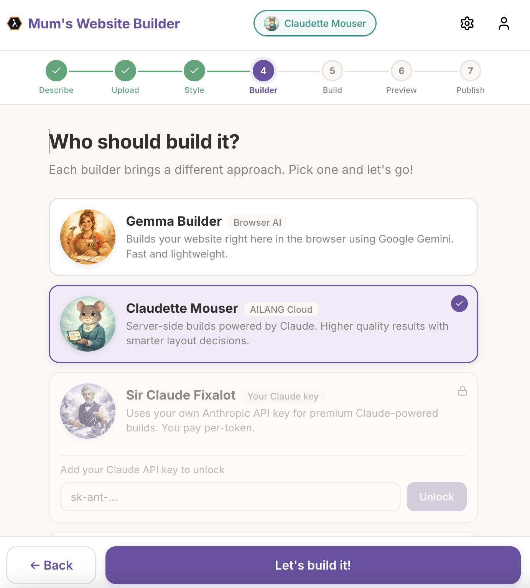
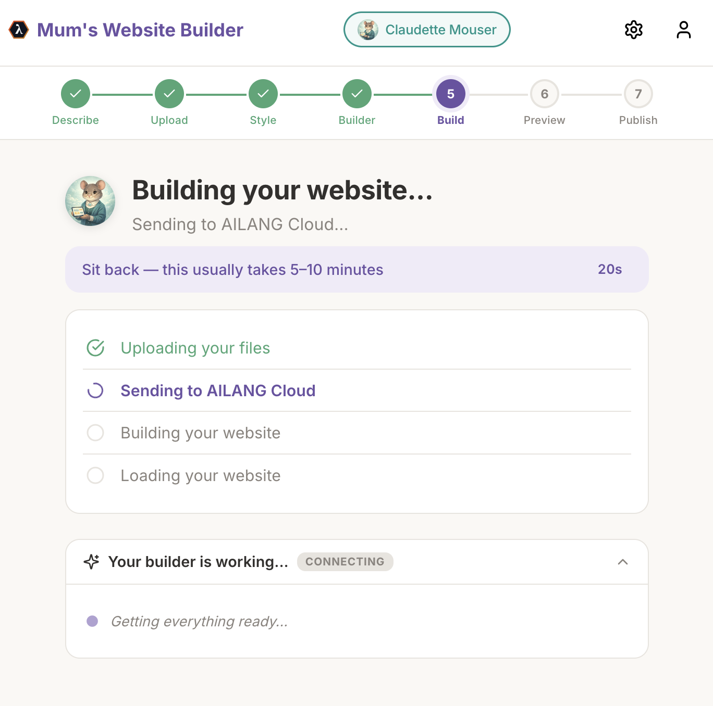
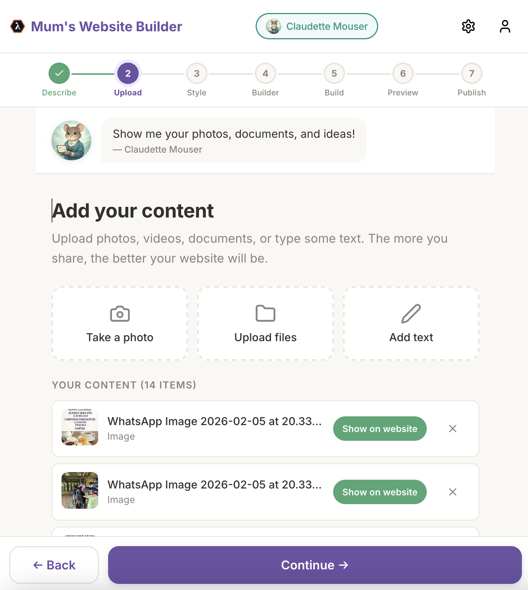
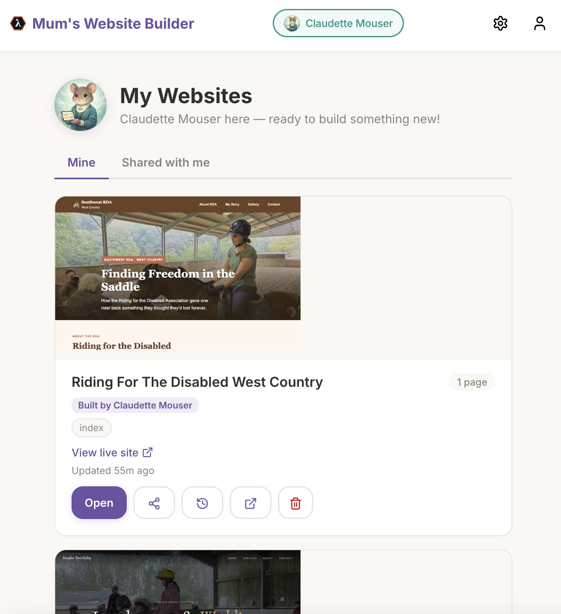

<p align="center">
  
</p>

<h1 align="center">AILANG Demos</h1>

<p align="center">
  <strong>Information-flow security, AI website builder, document intelligence, and streaming agents</strong><br>
  Built with <a href="https://ailang.sunholo.com/">AILANG</a> — a pure functional language with algebraic effects, contracts, and first-class AI.
</p>

<p align="center">
  <a href="https://www.sunholo.com/ailang-demos/"><strong>Live Demo Hub &rarr;</strong></a>
  &nbsp;&nbsp;|&nbsp;&nbsp;
  <a href="https://www.sunholo.com/"><strong>sunholo.com</strong></a>
</p>

---

## 10,000% AI-Coded

AILANG itself is **100% AI-coded** — the language, compiler, type checker, effect system, Z3 verification backend, WASM runtime, and standard library were all written by AI. These demos are **100% AI-coded using AILANG** — every `.ail` module, every contract, every streaming protocol integration.

That's 100% &times; 100% = **10,000% AI-coded.**

This isn't AI generating boilerplate. AILANG's type system, algebraic effects, and `requires`/`ensures` contracts mean the AI has to produce code that is **provably correct** — the compiler rejects anything that doesn't type-check, the contract verifier rejects anything that violates invariants, and capability budgets enforce hard resource limits. The result: AI writes the code, and the code proves itself safe.

<p align="center">
  
</p>

---

## Demos

### Can you make it leak?

[Try the leak lab](https://www.sunholo.com/ailang-demos/leak_lab/) — edit seven AILANG experiments and test whether secret-labelled data can cross a public boundary. Real browser-side compiler diagnostics show explicit flow tracking and the difference between declassification authority and sanitisation. No API key required. [Build and technical notes](leak_lab/README.md).

### Document Intelligence

<p align="center">
  
</p>

Parse, extract, and validate documents with formal safety guarantees. Every extraction result is validated by AILANG contracts — deterministic verification of stochastic AI output.

| Demo | Live Link | Description |
|------|-----------|-------------|
| **Document Extractor** | [Try it](https://www.sunholo.com/ailang-demos/extractor.html) | AI-powered extraction with schema detection and contract validation |
| **DocParse** | [Try it](https://www.sunholo.com/ailang-demos/docparse.html) | DOCX, PPTX, XLSX, PDF, and image parsing via AILANG WebAssembly |
| **Z3 Verify** | [Try it](https://www.sunholo.com/ailang-demos/verify.html) | Static contract verification showcase with Z3 theorem prover |
| **AI + Contracts** | [Try it](https://www.sunholo.com/ailang-demos/contracts-ai.html) | Schema extraction with contract validation and AI integration |

### Streaming & Voice

<p align="center">
  
</p>

Real-time streaming protocols — SSE, WebSocket bidirectional audio, and hybrid REST+SSE — all exercising AILANG's `std/stream` effect system. The CLI modules (`.ail`) are the canonical integration tests; browser UIs run the same AILANG code via WebAssembly.

| Demo | Live Link | Protocol | Description |
|------|-----------|----------|-------------|
| **Ambient Assistant** | [Try it](https://www.sunholo.com/ailang-demos/streaming/ambient_assistant/) | WebSocket bidi | Always-listening voice assistant — proactive audio, 9 browser tools, screen sharing, thinking display |
| **Voice DocParse** | [Try it](https://www.sunholo.com/ailang-demos/streaming/voice_docparse/) | WebSocket bidi | Talk to your documents via Gemini Live voice — upload DOCX, PPTX, XLSX, PDF, or images and discuss them |
| **Claude Chat** | [Try it](https://www.sunholo.com/ailang-demos/streaming/claude_chat/) | SSE | Streaming text responses from Claude Messages API |
| **Gemini Live** | [Try it](https://www.sunholo.com/ailang-demos/streaming/gemini_live/) | WebSocket bidi | Text to streaming audio — 30 voices, native WAV generation |
| **Safe Agent** | [Try it](https://www.sunholo.com/ailang-demos/streaming/safe_agent/) | WebSocket bidi | Contract-verified AI tool calling with safety guarantees |

### Cognitive Commons

A live, multi-tab AI debating society. Each browser tab is one citizen (Visionary / Skeptic / Synthesizer / Archivist). Citizens debate any topic, competing to drag a shared **sentiment dot** toward their corner of a 2D plane. The persona nearest the dot holds an edit lock on a rolling working statement — the commons' answer to the topic. Only the leader can update the draft; non-leaders must out-argue them first.

All compute is AILANG WASM — citizen composition, persuasion scoring, sentiment EWMA, and edit-lock logic are `.ail` modules. JS handles the constellation SVG, BroadcastChannel cross-tab relay, and provider bridging.

| Demo | Live Link | Description |
|------|-----------|-------------|
| **Cognitive Commons** | [Try it](https://www.sunholo.com/ailang-demos/cognitive_commons/) | Multi-tab AI debate — AILANG-driven citizen behaviour, persuasion judge, and consensus edit-lock |

### Data & Analytics

<p align="center">
  
</p>

BigQuery integration with contract-verified SQL generation. AILANG contracts guarantee that AI-generated queries are SELECT-only — no mutations, no injection, enforced at the language level.

| Demo | Description |
|------|-------------|
| **GA4 Analytics** | BigQuery queries with contract-verified SQL, capability budgets, and ADC auth — run locally via CLI |

### Outbound — LinkedIn

AILANG publishing to its own LinkedIn company page, then reading the replies back and turning them into public scored sketches. The CLI handles OAuth2 (via `std/net.urlEncodeForm`), REST publish, and comment ingestion, all in typed AILANG with capability budgets (`Net @limit=N`). A 3-hourly GitHub Actions cron sweeps every AILANG post for comments — LinkedIn caps the `socialActions/comments-GET_ALL` endpoint at 100/user/day, hence the 3h cadence.

The comment-driven sketches feature is the heart of the demo: when a reader replies with `<your-url> #ailangAgentReady` (or `#ailangPrivacy` / `#ailangPortable`), the next cron tick fetches the URL, runs it through AILANG Parse + a single Gemini classification call, scores it against a contract-verified rubric (20 signals, each mapped to a real AILANG primitive — IFC labels, capability budgets, `requires`/`ensures` contracts, `std/ai`, three-runtime deploy), and publishes a public sketch at `/linkedin/topics/<topic>/<your-domain>/`. Three leaderboards rank the entries.

| Demo | Live Link | Description |
|------|-----------|-------------|
| **LinkedIn — overview** | [Try it](https://www.sunholo.com/ailang-demos/linkedin/) | The transmission strip, the live post card, the three threads, real reader comments |
| **agent-ready leaderboard** | [Top board](https://www.sunholo.com/ailang-demos/linkedin/topics/agent-ready/) | Sites scored on A2A, OpenAPI, MCP, webhooks, rate limits, auth, idempotency |
| **privacy leaderboard** | [Top board](https://www.sunholo.com/ailang-demos/linkedin/topics/privacy/) | Sites scored on E2EE, compliance certs, data-minimisation, residency language |
| **portable leaderboard** | [Top board](https://www.sunholo.com/ailang-demos/linkedin/topics/portable/) | Sites scored on multi-provider AI, BYO key, cross-runtime claims |

### Website Builder & AILANG Cloud

<p align="center">
  
</p>

AI-powered website generation from text descriptions, photos, and documents. The **first public use case for AILANG Cloud** — server-side compute dispatched through AILANG's messaging protocol. Two build modes: WASM (in-browser) and AILANG Cloud (server-side via Coordinator).

| Demo | Live Link | Description |
|------|-----------|-------------|
| **Website Builder** | [Try it](https://www.sunholo.com/ailang-demos/website_builder/) | Describe → Upload → Style → Build → Preview → Publish, with WASM and AILANG Cloud build modes |

---

## Demo Showcase

### Document Extractor

Upload any document — text, image, or PDF — define a schema (or let AI detect one), and get validated, type-safe extraction results. Nothing leaves your browser except the API call to the AI provider — and the provider is swappable via AILANG's `! {AI}` effect system. The extractor validates every AI response against AILANG contracts before returning results, catching malformed or out-of-spec output at the language boundary.

**[Try it live &rarr;](https://www.sunholo.com/ailang-demos/extractor.html)**


**Features:** 7 demo presets (invoice, receipt, contract, bank statement, shipping label, resume, PDF invoice), AI schema detection, multimodal file upload (images + PDFs), real-time pipeline visualization, 3-tier graceful degradation, generated AILANG code view. AILANG validates every AI extraction result with contracts and type-safe JSON parsing — deterministic validation of stochastic AI output.

### DocParse

Drop a DOCX, PPTX, XLSX, PDF, or image and get structured output — headings, tables (with merged cells), images, text boxes, track changes, comments, and more. 10 AILANG modules parse Office XML directly in WebAssembly via `std/xml` and `std/zip`. No server, no heavy dependencies — the entire parser is pure AILANG functions running in your browser. 28 contracts enforce structural invariants: filter bounds, 1:1 mapper preservation, size guarantees. 17 real-world test files.

**[Try DocParse &rarr;](https://www.sunholo.com/ailang-demos/docparse.html)**


**Features:** DOCX/PPTX/XLSX deterministic XML parsing, PDF and image AI extraction, merged cell handling, track change detection (insert/delete/move), comment extraction, AI image descriptions, AI self-healing for ambiguous tables, 4 output views (blocks, preview, JSON, markdown), copy-to-clipboard, Block ADT with pattern matching.

### Voice DocParse

Upload a document and talk to it. Gemini Live bidirectional audio streaming lets you ask questions about your documents conversationally. Documents are parsed by the same AILANG WASM modules that power DocParse — embedded images are described by AI via the `std/ai` effect — and the extracted content is injected into the Gemini Live session context so the model can answer questions about your data in real time.

**[Try Voice DocParse &rarr;](https://www.sunholo.com/ailang-demos/streaming/voice_docparse/)**

**Features:** Bidirectional audio via Gemini Live WebSocket, document upload mid-conversation, AILANG WASM parsing (Office XML + AI for PDF/images), AI image descriptions via `std/ai` effect, real-time audio playback, chat transcript with document preview.

### Ambient Assistant

An always-listening voice assistant that stays silent until addressed by name ("AILANG"). Uses Gemini Live's proactive audio — the model hears everything but only responds when spoken to directly. The browser demo features an animated Ambient Orb that visualizes connection state, screen sharing for visual context, and 9 browser tools including screenshot capture, web fetching, and note-taking.

**[Try Ambient Assistant &rarr;](https://www.sunholo.com/ailang-demos/streaming/ambient_assistant/)**


**Features:** Proactive audio (model decides when to respond), screen sharing with on-demand screenshots, 9 browser tools (time, calculate, cache, remind, summarize, screenshot, notes, web fetch), thinking bubble display, animated Ambient Orb UI, real-time transcription sidebar, AILANG WASM protocol construction. CLI version adds 11 tools with shell access, async background execution, video input, and session persistence.

### Safe Agent

Contract-verified AI tool calling. The agent has access to tools (calculator, file reader, SQL query runner) but every tool is wrapped in AILANG `requires`/`ensures` contracts that enforce safety invariants at the language level. If the AI tries to call a tool with invalid arguments — a negative subtotal, a path traversal attack, a mutating SQL query — the contract blocks it *before execution*. The contracts are also statically verifiable via Z3: `ailang verify` can prove at compile time that the calculator never overflows and file reads never escape the sandbox.

**[Try Safe Agent &rarr;](https://www.sunholo.com/ailang-demos/streaming/safe_agent/)**


**Features:** Gemini Live WebSocket for voice interaction, AILANG contract-verified tools loaded via WASM, business tools (calculator, formatter, validator), real-time tool call visualization, safety violation display.

### Static Verification (Z3)

Prove contracts correct at compile time — no tests needed, no runtime overhead. **42 contracts verified, 4 bugs caught** across 4 modules covering cloud billing, access control, resource scheduling, and arithmetic. Z3 catches bugs that are invisible to traditional testing — like a credit-apply function that silently allows negative totals when `subtotal=0, credits=1`.

**[Try Z3 Verify &rarr;](https://www.sunholo.com/ailang-demos/verify.html)**

```
$ ailang verify verify_demo/billing.ail

  ✓ VERIFIED finalBill          22ms   # 4-deep cross-function chain
  ✓ VERIFIED isValidPromo        5ms   # Z3 string theory
  ✓ VERIFIED addLineItem        44ms   # Z3 sequence theory
  ✓ VERIFIED netFromBill         5ms   # record field invariants
  ... (12 verified, 1 violation)
  ✗ VIOLATION brokenCreditApply
    Counterexample: subtotal=0, credits=1
```

**Features:** Cloud billing (enums + records + strings + lists + 4-deep cross-function chains), role-based access control (48 permission paths, admin supremacy, guest isolation, role monotonicity), conference room scheduling (priority ordering, capacity bounds), arithmetic contracts. JSON output for CI, verbose SMT-LIB. Requires Z3 (`brew install z3`).

### Streaming — CLI Demos

All streaming demos have CLI modules (`.ail`) alongside their browser UIs. The CLI modules are the canonical integration tests for AILANG's `std/stream` effect — SSE via `ssePost`/`sseConnect`, WebSocket via `connect`/`transmit`/`onEvent`. Each demo exercises a different streaming pattern so we can verify the full protocol surface.

| Demo | Protocol | CLI Status | What it does |
|------|----------|-----------|-------------|
| **Ambient Assistant** | WebSocket bidi | Working | Always-listening voice assistant — proactive audio, 11 tools, screen/webcam, async tools |
| **Gemini Live** | WebSocket bidi | Working | Text to streaming audio — 30 voices, native WAV generation |
| **Claude Chat** | SSE | Working | Streaming text responses from Claude Messages API |
| **Gemini SSE** | SSE | Working | Minimal Gemini streaming test via ADC |
| **Safe Agent** | REST + SSE | Working | Contract-verified tool calling with safety guarantees |
| Transcription | WebSocket | Type-checks | Deepgram speech-to-text |
| Voice Analytics | WebSocket bidi | Type-checks | Voice queries to BigQuery via Gemini Live + tool calling |
| Voice DocParse | WebSocket bidi | Type-checks | Voice-based document Q&A via Gemini Live + DocParse |
| Voice Pipeline | WebSocket (dual) | Type-checks | Deepgram STT + ElevenLabs TTS pipeline |

```bash
# Install CLI wrappers (work from any directory)
ln -s $(pwd)/streaming/ambient_assistant/ambient ~/.local/bin/ambient
ln -s $(pwd)/streaming/gemini_live/speak ~/.local/bin/speak

# Ambient Assistant — always-listening voice assistant
ambient --mic "Hey AILANG"
ambient --mic --screen "What do you see?"

# AILANG speaks
speak "Tell me a joke"
speak --voice Charon "What is AILANG?"
speak --tools "What's the git status?"    # with tool calling
```

### Cognitive Commons

Open four tabs. Assign each a persona. Watch them argue. The AILANG modules (`citizen.ail`, `persuasion.ail`, `consensus.ail`) run entirely in WebAssembly — every AI call, every sentiment update, every edit-lock check goes through AILANG's `! {AI}` effect system, not raw JS.

**[Try Cognitive Commons &rarr;](https://www.sunholo.com/ailang-demos/cognitive_commons/)**

**How it works:**

1. Each tab calls `speakJson(state, persona, prompt, topic, dialogue, clock, region)` in AILANG
2. AILANG composes a stanza via the citizen's persona prompt, judges it on the (x, y) sentiment plane, applies EWMA, and checks the edit lock — all inside the WASM sandbox
3. The updated state JSON is broadcast via BroadcastChannel so every other tab's constellation updates in sync
4. The persona currently closest to the sentiment dot holds the edit lock; only they can advance the working statement

**Features:** 4 personas with editable system prompts, onboarding auto-start on first speak, 2D sentiment constellation with animated dot + persona targets + trail, cross-tab BroadcastChannel state sync, judge score chip per stanza, manifesto panel with edit-lock display, provider-agnostic (Anthropic / OpenAI / OpenRouter / Gemini), shared `<provider>-api-key` localStorage convention.

**AILANG modules:** `cognitive_commons/types/personas.ail` (ADTs, targets, prompts), `cognitive_commons/services/consensus.ail` (pure EWMA + edit-lock), `cognitive_commons/services/persuasion.ail` (judge LLM call), `cognitive_commons/services/citizen.ail` (compose loop), `cognitive_commons/services/commons_browser.ail` (WASM JSON adapter).

### Website Builder

Describe your business, upload photos and documents, pick a style, and get a multi-page website generated and published to GitHub Pages. No code required. The **first public use case for AILANG Cloud** — server-side AI compute dispatched through AILANG's messaging protocol.

**[Try Website Builder &rarr;](https://www.sunholo.com/ailang-demos/website_builder/)**

**Two build modes:**

| Mode | How it works | Best for |
|------|-------------|----------|
| **Gemma Builder** (WASM) | AILANG runs in the browser via WebAssembly, calls Gemini directly with your API key | Fast iteration, no server needed |
| **Claudette Mouser** (AILANG Cloud) | Build brief sent to AILANG Coordinator → Cloud Run agent runs the AILANG pipeline server-side | Higher quality, no API key needed |

<p align="center">
  
  &nbsp;&nbsp;
  
</p>

The Cloud path dispatches work via REST API to the AILANG Coordinator, which spins up a Cloud Run job. The portal tracks progress through polling (5s intervals) and an optional WebSocket stream for real-time build updates. Correlation IDs tie requests to completions, so concurrent builds work out of the box. Generated pages are committed to GitHub and served via GitHub Pages.

See the [AILANG Cloud Messaging Guide](https://ailang.sunholo.com/docs/cloud-messaging) for the technical integration pattern.

<p align="center">
  
  &nbsp;&nbsp;
  
</p>

**Features:** 7-step wizard (Describe → Upload → Style → Builder → Build → Preview → Publish), 3 builder personas, 6 style directions, media upload (photos, videos, documents), AILANG contract-verified validation, Firebase auth with Google sign-in, site sharing, GitHub Pages publishing, form submission handling via Google Sheets.

```bash
# CLI mode (AILANG pipeline directly)
GENERATE=true GOOGLE_API_KEY="" ailang run --entry main --caps IO,FS,AI,Env \
  --ai gemini-2.5-flash website_builder/main.ail "My flower arranging business"
```

### Ecommerce

Six working demos covering AI integration, data pipelines, capability budgets, BigQuery analytics, design-by-contract verification, and a REST API with React UI. The ecommerce vertical demonstrates AILANG's shared services pattern — modules like `gcp_auth`, `bigquery`, and `ai_service` are reused across streaming, analytics, and safe agent demos.


**Features:** Contract verification forms, live BigQuery analytics with charts, AI-powered product recommendations, server status monitoring, and zero-code API generation from AILANG modules.

---

## What is AILANG?

<p align="center">
  
</p>

AILANG is a pure functional language designed for AI-native applications. It's **100% AI-coded** — the compiler, type system, and standard library were all written by AI — and it's designed so that AI can write provably correct programs in it.

The core idea: every layer of the software engineering stack has mechanical guarantees (CI/CD, type checkers, package managers, IaC) — except the one layer AI just automated: *writing code*. AILANG closes that gap with a language-level contract system backed by Z3, an effect system that enforces capability budgets, and Hindley-Milner type inference that catches errors before runtime.

- **Hindley-Milner type inference** — types are inferred, not annotated
- **Algebraic effects** — controlled side effects via capabilities (`IO`, `FS`, `Net`, `AI`)
- **Capability budgets** — hard limits on resource usage with `@limit=N`
- **Pattern matching** — on lists, `Option`, `Result`, and custom ADTs
- **First-class AI** — `std/ai` effect for calling any AI provider
- **Contracts** — `requires`/`ensures` preconditions and postconditions
- **Static verification** — `ailang verify` proves contracts via Z3 SMT solver
- **WebAssembly** — run AILANG in the browser with full stdlib support

---

## Install CLI Tools

```bash
# From the demos/ directory — all work from any directory via symlink resolution
ln -s $(pwd)/docparse/docparse ~/.local/bin/docparse
ln -s $(pwd)/streaming/gemini_live/speak ~/.local/bin/speak
ln -s $(pwd)/streaming/ambient_assistant/ambient ~/.local/bin/ambient
```

## Install AILANG

**Claude Code:**
```
/plugin marketplace add sunholo-data/ailang_bootstrap
/plugin install ailang
```

**Gemini CLI:**
```
gemini extensions install https://github.com/sunholo-data/ailang_bootstrap.git
```

See [ailang.sunholo.com](https://ailang.sunholo.com/) for full docs.

## Repository Structure

```
demos/
├── ailang-logo.svg              # AILANG logo (hexagon + lambda)
├── vision-stack.svg             # Software engineering stack diagram
├── vision-hero.svg              # Trust inversion animated diagram
├── ai-engineer.svg              # AI engineering neural pattern
├── site/
│   └── index.html               # Demo hub page (sunholo.com/ailang-demos/)
├── docparse/                    # DocParse AILANG source (10 modules)
│   ├── docparse                 # CLI wrapper → symlink to ~/.local/bin/docparse
│   ├── main.ail                 # Entry point, CLI args, format routing
│   ├── types/document.ail       # Block ADT, TableCell, metadata types
│   ├── services/                # Format parsers, AI, output formatter
│   └── data/test_files/         # 17 real-world test files
├── streaming/                   # Real-time streaming demos
│   ├── index.html               # Streaming hub page
│   ├── shared/                  # Shared browser assets (nav, audio worklet, logo)
│   ├── test_sse.ail             # Minimal Gemini SSE test
│   ├── ambient_assistant/       # Always-listening voice assistant (mic, video, tools)
│   ├── gemini_live/             # Text to audio via WebSocket bidi
│   ├── claude_chat/             # Claude SSE streaming
│   ├── safe_agent/              # Contract-verified AI agent
│   ├── voice_docparse/          # Voice + DocParse (document Q&A)
│   ├── transcription/           # Deepgram STT
│   ├── voice_analytics/         # Voice + BigQuery
│   └── voice_pipeline/          # STT + LLM + TTS
├── website_builder/             # AI website generation pipeline
│   ├── main.ail                 # Content → structure → HTML via Gemini
│   ├── types/                   # Content ADTs
│   ├── services/                # Extractor, structurer, validator, generator
│   ├── portal/                  # Vue 3 SPA + Express sidecar (Cloud Run)
│   ├── docs/screenshots/        # Portal screenshots
│   └── output/                  # Generated HTML + CSS
├── ecommerce/                   # Ecommerce vertical demo
│   ├── main.ail                 # AI product recommendations
│   └── services/                # Shared services (auth, BigQuery, AI)
├── leak_lab/                    # Browser information-flow challenge (AILANG v0.35.0)
│   ├── examples/                # Seven editable secret-flow experiments
│   ├── compiler/                # Pinned Go/WASM bridge and regression tests
│   └── upstream/                # Module loader IFC fix with tests
├── cognitive_commons/           # Multi-tab AI debating society (AILANG WASM)
│   ├── index.html               # UI shell (constellation, chronicle, onboarding)
│   ├── types/personas.ail       # Persona ADT, targets, default prompts
│   ├── services/consensus.ail   # Pure: sentiment EWMA, edit-lock
│   ├── services/persuasion.ail  # Judge LLM call → JudgeScore {x, y}
│   ├── services/citizen.ail     # Compose loop ! {AI, DOM, Msg}
│   ├── services/commons_browser.ail  # WASM JSON adapter (speakJson)
│   └── cog/                     # Cognitive OS browser JS (host.js, canonical_dom.js)
├── verify_demo/                 # Static contract verification (42 contracts)
│   ├── billing.ail              # Cloud billing: cross-function chains
│   ├── access_policy.ail        # RBAC: 48 permission paths
│   ├── scheduling.ail           # Booking: capacity bounds
│   └── main.ail                 # Runtime demo
├── scripts/                     # Claude Code hooks (voice debrief, waiting alert)
├── invoice_processor_wasm/      # WASM runtime + browser demos
│   ├── index.html               # Document Extractor
│   ├── docparse.html            # DocParse browser
│   ├── verify.html              # Z3 Verify browser
│   ├── contracts-ai.html        # AI + Contracts browser
│   └── wasm/                    # AILANG WASM binary
└── .github/workflows/           # GitHub Actions → GitHub Pages deploy
```

## References

- [AILANG Demo Hub — Live](https://www.sunholo.com/ailang-demos/)
- [AILANG Documentation](https://ailang.sunholo.com/)
- [AILANG Source](https://github.com/sunholo-data/ailang)
- [Demo Source Code](https://github.com/sunholo-data/ailang-demos)
