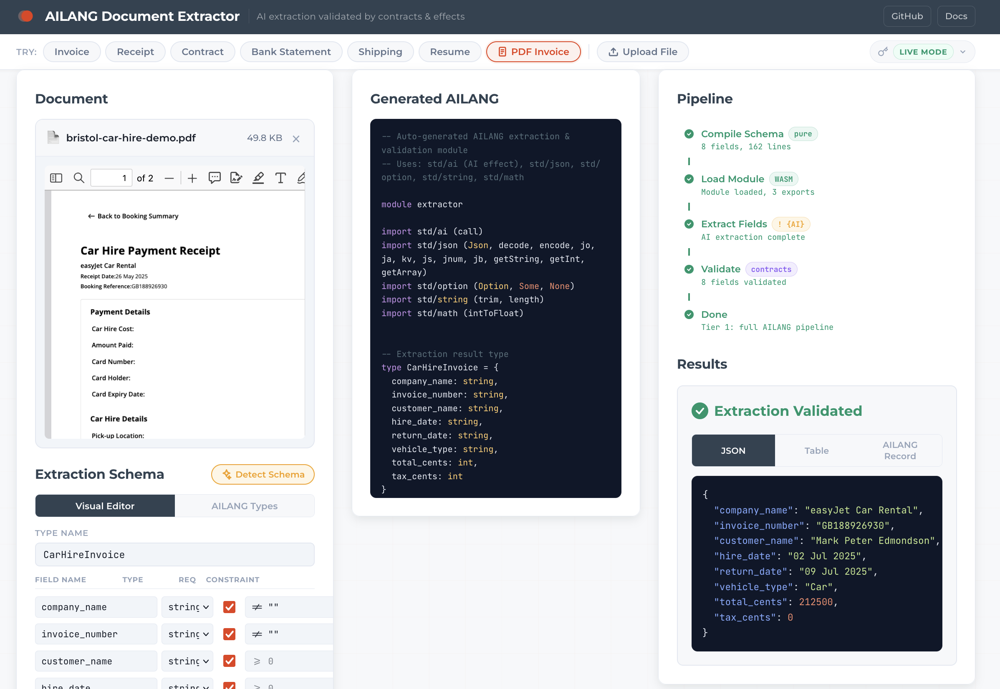
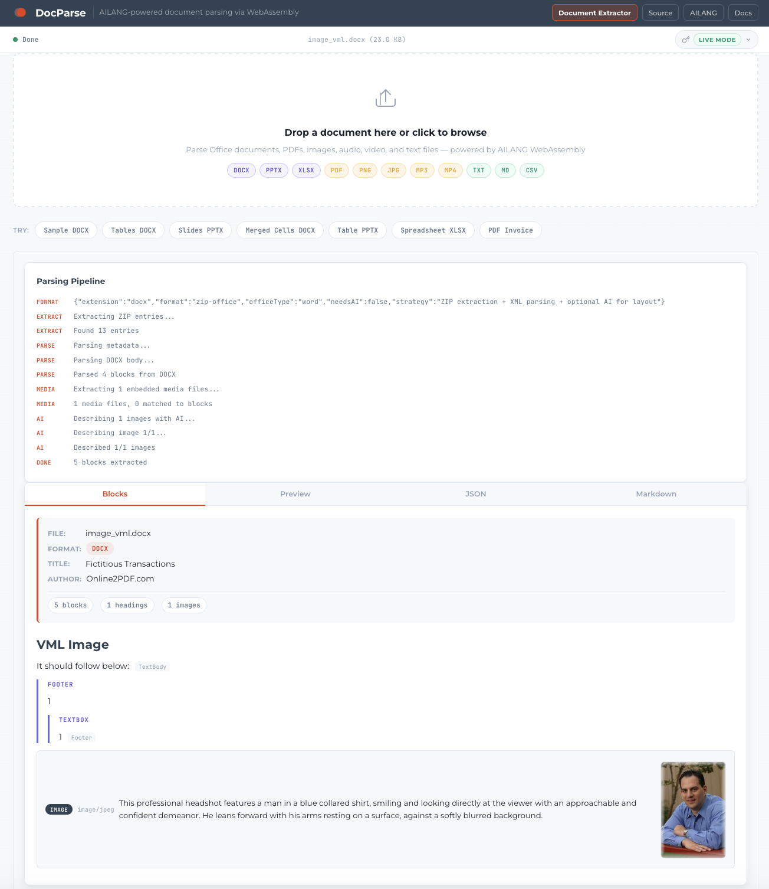
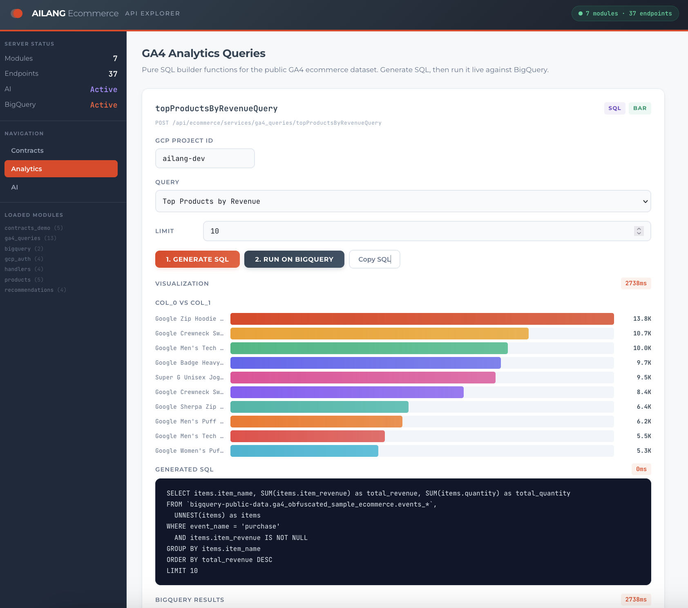

<p align="center">
  
</p>

<h1 align="center">AILANG Demos</h1>

<p align="center">
  <strong>Document intelligence, streaming protocols, and contract-verified AI agents</strong><br>
  Built with <a href="https://ailang.sunholo.com/">AILANG</a> — a pure functional language with algebraic effects, contracts, and first-class AI.
</p>

<p align="center">
  <a href="https://www.sunholo.com/ailang-demos/"><strong>Live Demo Hub &rarr;</strong></a>
</p>

---

## Demos

### Document Intelligence

| Demo | Live Link | Description |
|------|-----------|-------------|
| **Document Extractor** | [Try it](https://www.sunholo.com/ailang-demos/extractor.html) | AI-powered extraction with schema detection and contract validation |
| **DocParse** | [Try it](https://www.sunholo.com/ailang-demos/docparse.html) | DOCX, PPTX, XLSX, PDF, and image parsing via AILANG WebAssembly |
| **Z3 Verify** | [Try it](https://www.sunholo.com/ailang-demos/verify.html) | Static contract verification showcase with Z3 theorem prover |
| **AI + Contracts** | [Try it](https://www.sunholo.com/ailang-demos/contracts-ai.html) | Schema extraction with contract validation and AI integration |

### Streaming & Voice

| Demo | Live Link | Protocol | Description |
|------|-----------|----------|-------------|
| **Voice DocParse** | [Try it](https://www.sunholo.com/ailang-demos/streaming/voice_docparse/) | WebSocket bidi | Talk to your documents via Gemini Live voice — upload DOCX, PPTX, XLSX, PDF, or images and discuss them |
| **Claude Chat** | [Try it](https://www.sunholo.com/ailang-demos/streaming/claude_chat/) | SSE | Streaming text responses from Claude Messages API |
| **Gemini Live** | [Try it](https://www.sunholo.com/ailang-demos/streaming/gemini_live/) | WebSocket bidi | Text to streaming audio — 30 voices, native WAV generation |
| **Safe Agent** | [Try it](https://www.sunholo.com/ailang-demos/streaming/safe_agent/) | WebSocket bidi | Contract-verified AI tool calling with safety guarantees |

### Data & Analytics

| Demo | Description |
|------|-------------|
| **GA4 Analytics** | BigQuery queries with contract-verified SQL, capability budgets, and ADC auth — run locally via CLI |

---

## Demo Showcase

### Document Extractor

Upload any document — text, image, or PDF — define a schema (or let AI detect one), and get validated, type-safe extraction results. **100% local, 100% AI-coded.** Nothing leaves your browser except the API call to the AI provider — and the provider is swappable via AILANG's `! {AI}` effect system.

**[Try it live &rarr;](https://www.sunholo.com/ailang-demos/extractor.html)**



**Features:** 7 demo presets (invoice, receipt, contract, bank statement, shipping label, resume, PDF invoice), AI schema detection, multimodal file upload (images + PDFs), real-time pipeline visualization, 3-tier graceful degradation, generated AILANG code view. AILANG validates every AI extraction result with contracts and type-safe JSON parsing — deterministic validation of stochastic AI output.

### DocParse

Drop a DOCX, PPTX, XLSX, PDF, or image and get structured output — headings, tables (with merged cells), images, text boxes, track changes, comments, and more. 8 AILANG modules parse Office XML directly in WebAssembly via `std/xml`. No server, no heavy dependencies. 28 contracts, 17 real-world test files, all pure functions.

**[Try DocParse &rarr;](https://www.sunholo.com/ailang-demos/docparse.html)**



**Features:** DOCX/PPTX/XLSX deterministic XML parsing, PDF and image AI extraction, merged cell handling, track change detection (insert/delete/move), comment extraction, AI image descriptions, AI self-healing for ambiguous tables, 4 output views (blocks, preview, JSON, markdown), copy-to-clipboard, Block ADT with pattern matching.

### Voice DocParse

Upload a document and talk to it. Gemini Live bidirectional audio streaming lets you ask questions about your documents conversationally. Supports DOCX, PPTX, XLSX, PDF, and images — documents are parsed via AILANG WASM modules (the same ones powering DocParse), with embedded images described by AI. The extracted content is injected into the Gemini Live session context so the model can answer questions about it.

**[Try Voice DocParse &rarr;](https://www.sunholo.com/ailang-demos/streaming/voice_docparse/)**

**Features:** Bidirectional audio via Gemini Live WebSocket, document upload mid-conversation, AILANG WASM parsing (Office XML + AI for PDF/images), AI image descriptions via `std/ai` effect, real-time audio playback, chat transcript with document preview.

### Safe Agent

Contract-verified AI tool calling. The agent has access to tools (calculator, file reader, command runner) but every tool is wrapped in AILANG contracts that enforce safety invariants. If the AI tries to call a tool with invalid arguments, the contract blocks it before execution.

**[Try Safe Agent &rarr;](https://www.sunholo.com/ailang-demos/streaming/safe_agent/)**

**Features:** Gemini Live WebSocket for voice interaction, AILANG contract-verified tools loaded via WASM, business tools (calculator, formatter, validator), real-time tool call visualization, safety violation display.

### Static Verification (Z3)

Prove contracts correct at compile time — no tests needed, no runtime overhead. **42 contracts verified, 4 bugs caught** across 4 modules covering cloud billing, access control, resource scheduling, and arithmetic. Z3 catches bugs invisible to traditional testing.

**[Try Z3 Verify &rarr;](https://www.sunholo.com/ailang-demos/verify.html)**

```
$ ailang verify verify_demo/billing.ail

  ✓ VERIFIED finalBill          22ms   # 4-deep cross-function chain
  ✓ VERIFIED isValidPromo        5ms   # Z3 string theory
  ✓ VERIFIED addLineItem        44ms   # Z3 sequence theory
  ✓ VERIFIED netFromBill         5ms   # record field invariants
  ... (12 verified, 1 violation)
  ✗ VIOLATION brokenCreditApply
    Counterexample: subtotal=0, credits=1
```

**Features:** Cloud billing (enums + records + strings + lists + 4-deep cross-function chains), role-based access control (48 permission paths, admin supremacy, guest isolation, role monotonicity), conference room scheduling (priority ordering, capacity bounds), arithmetic contracts. JSON output for CI, verbose SMT-LIB. Requires Z3 (`brew install z3`).

### Streaming — CLI Demos

All streaming demos have CLI modules (`.ail`) alongside their browser UIs. The CLI modules are the canonical integration tests for AILANG's `std/stream` effect.

| Demo | Protocol | CLI Status | What it does |
|------|----------|-----------|-------------|
| **Gemini Live** | WebSocket bidi | Working | Text to streaming audio — 30 voices, native WAV generation |
| **Claude Chat** | SSE | Working | Streaming text responses from Claude Messages API |
| **Gemini SSE** | SSE | Working | Minimal Gemini streaming test via ADC |
| **Safe Agent** | REST + SSE | Working | Contract-verified tool calling with safety guarantees |
| Transcription | WebSocket | Type-checks | Deepgram speech-to-text |
| Voice Analytics | WebSocket bidi | Type-checks | Voice queries to BigQuery via Gemini Live + tool calling |
| Voice DocParse | WebSocket bidi | Type-checks | Voice-based document Q&A via Gemini Live + DocParse |
| Voice Pipeline | WebSocket (dual) | Type-checks | Deepgram STT + ElevenLabs TTS pipeline |

```bash
# Install the speak wrapper (works from any directory)
ln -s $(pwd)/streaming/gemini_live/speak ~/.local/bin/speak

# AILANG speaks
speak "Tell me a joke"
speak --voice Charon "What is AILANG?"
speak -v Orus "Explain algebraic effects"
speak --tools "What's the git status?"    # with tool calling
```

### Ecommerce

Six working demos covering AI integration, data pipelines, capability budgets, BigQuery analytics, design-by-contract verification, and a REST API with React UI.



**Features:** Contract verification forms, live BigQuery analytics with charts, AI-powered product recommendations, server status monitoring, and zero-code API generation from AILANG modules.

---

## Install CLI Tools

```bash
# From the demos/ directory — both work from any directory via symlink resolution
ln -s $(pwd)/docparse/docparse ~/.local/bin/docparse
ln -s $(pwd)/streaming/gemini_live/speak ~/.local/bin/speak
```

## Install AILANG

**Claude Code:**
```
/plugin marketplace add sunholo-data/ailang_bootstrap
/plugin install ailang
```

**Gemini CLI:**
```
gemini extensions install https://github.com/sunholo-data/ailang_bootstrap.git
```

See [ailang.sunholo.com](https://ailang.sunholo.com/) for full docs.

## What is AILANG?

AILANG is a pure functional language designed for AI-native applications:

- **Hindley-Milner type inference** — types are inferred, not annotated
- **Algebraic effects** — controlled side effects via capabilities (`IO`, `FS`, `Net`, `AI`)
- **Capability budgets** — hard limits on resource usage with `@limit=N`
- **Pattern matching** — on lists, `Option`, `Result`, and custom ADTs
- **First-class AI** — `std/ai` effect for calling any AI provider
- **Contracts** — `requires`/`ensures` preconditions and postconditions
- **Static verification** — `ailang verify` proves contracts via Z3 SMT solver
- **WebAssembly** — run AILANG in the browser with full stdlib support

## Repository Structure

```
demos/
├── ailang-logo.svg              # AILANG logo (hexagon + lambda)
├── site/
│   └── index.html               # Demo hub page (sunholo.com/ailang-demos/)
├── docparse/                    # DocParse AILANG source (10 modules)
│   ├── docparse                 # CLI wrapper → symlink to ~/.local/bin/docparse
│   ├── main.ail                 # Entry point, CLI args, format routing
│   ├── types/document.ail       # Block ADT, TableCell, metadata types
│   ├── services/                # Format parsers, AI, output formatter
│   └── data/test_files/         # 17 real-world test files
├── streaming/                   # Real-time streaming demos
│   ├── index.html               # Streaming hub page
│   ├── shared/                  # Shared browser assets (nav, audio worklet, logo)
│   ├── test_sse.ail             # Minimal Gemini SSE test
│   ├── gemini_live/             # Text to audio via WebSocket bidi
│   ├── claude_chat/             # Claude SSE streaming
│   ├── safe_agent/              # Contract-verified AI agent
│   ├── voice_docparse/          # Voice + DocParse (document Q&A)
│   ├── transcription/           # Deepgram STT
│   ├── voice_analytics/         # Voice + BigQuery
│   └── voice_pipeline/          # STT + LLM + TTS
├── ecommerce/                   # Ecommerce vertical demo
│   ├── main.ail                 # AI product recommendations
│   └── services/                # Shared services (auth, BigQuery, AI)
├── verify_demo/                 # Static contract verification (42 contracts)
│   ├── billing.ail              # Cloud billing: cross-function chains
│   ├── access_policy.ail        # RBAC: 48 permission paths
│   ├── scheduling.ail           # Booking: capacity bounds
│   └── main.ail                 # Runtime demo
├── invoice_processor_wasm/      # WASM runtime + browser demos
│   ├── index.html               # Document Extractor
│   ├── docparse.html            # DocParse browser
│   ├── verify.html              # Z3 Verify browser
│   ├── contracts-ai.html        # AI + Contracts browser
│   └── wasm/                    # AILANG WASM binary
└── .github/workflows/           # GitHub Actions → GitHub Pages deploy
```

## References

- [AILANG Demo Hub — Live](https://www.sunholo.com/ailang-demos/)
- [AILANG Documentation](https://ailang.sunholo.com/)
- [AILANG Source](https://github.com/sunholo-data/ailang)
- [Demo Source Code](https://github.com/sunholo-data/ailang-demos)
