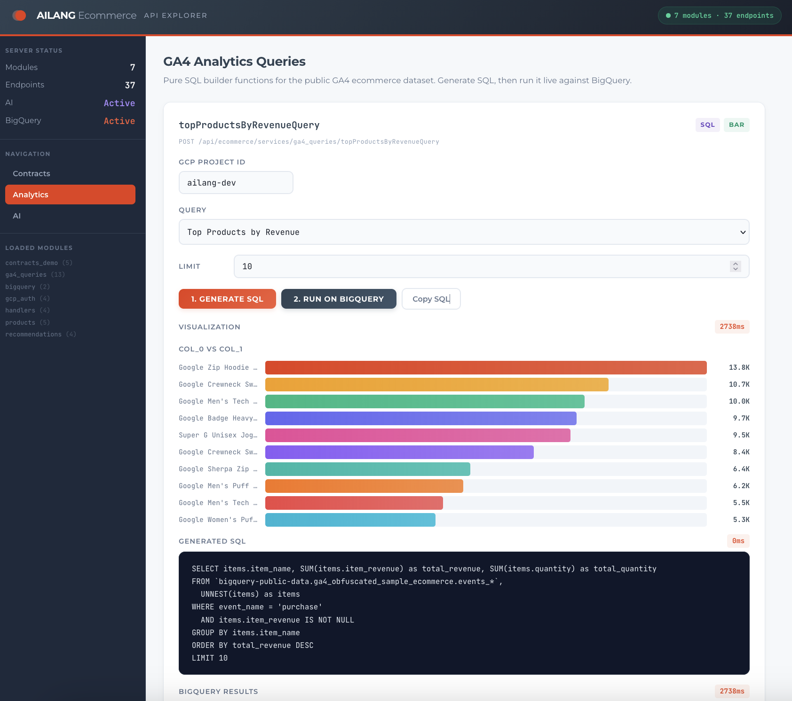

# AILANG Ecommerce Demo

A vertical demo showcasing [AILANG](https://ailang.sunholo.com/) for ecommerce applications. Six working demos cover AI integration, data pipelines, capability budgets, BigQuery analytics, design-by-contract verification, and a REST API with React UI.

## Quick Start

### Install AILANG

**Claude Code:**
```
/plugin marketplace add sunholo-data/ailang_bootstrap
/plugin install ailang
```

**Gemini CLI:**
```
gemini extensions install https://github.com/sunholo-data/ailang_bootstrap.git
```

See [ailang.sunholo.com](https://ailang.sunholo.com/) for full installation docs.

### Run the Demos

```bash
# Run the simplest demo (no API keys needed)
ailang run --entry main --caps IO,FS ecommerce/pipeline_runner.ail

# Run AI demo with stub (no API keys needed)
ailang run --entry main --caps IO,AI --ai-stub ecommerce/main.ail

# Run inline tests
ailang test ecommerce/services/ga4_queries.ail
```

## Demos

### 1. AI Product Recommendations

Uses AILANG's `std/ai` effect to call AI models for product recommendations and descriptions. Demonstrates the AI effect system, JSON handling, and modular service design.

**Key code** (`services/recommendations.ail`):
```haskell
export func getProductRecommendations(
  productName: string, category: string, userPreferences: string
) -> string ! {AI} {
  let prompt = "You are an ecommerce recommendation engine. " ++
    "Given the product '" ++ productName ++ "' in category '" ++ category ++ "', " ++
    "and user preferences: " ++ userPreferences ++ ". " ++
    "Return a JSON array of 3 recommended product names.";
  call(prompt)
}
```

**Run:**
```bash
# With any AI provider:
ailang run --entry main --caps IO,AI --ai claude-haiku-4-5 ecommerce/main.ail
ailang run --entry main --caps IO,AI --ai gpt5-mini ecommerce/main.ail
ailang run --entry main --caps IO,AI --ai gemini-2-5-flash ecommerce/main.ail

# With stub (no API key needed):
ailang run --entry main --caps IO,AI --ai-stub ecommerce/main.ail
```

**Expected output** (with `--ai claude-haiku-4-5`; AI responses vary per run):

~~~
=== AILANG Ecommerce Demo ===

1. Getting AI product recommendations...
Recommendations: {
  "recommendations": [
    "Active Noise Cancelling Over-Ear Headphones with Premium Sound",
    "Wireless Earbuds with Advanced Noise Cancellation and Hi-Fi Audio",
    "Studio Monitor Bluetooth Headphones with Hybrid Noise Cancelling"
  ]
}

2. Generating product description...
Description: Experience the perfect blend of performance and comfort.
Our Ultra-Comfort Running Shoes feature advanced breathable mesh that
keeps feet cool and dry during every stride. Engineered with premium
gel cushioning technology, these lightweight runners absorb impact and
reduce fatigue, while contoured arch support promotes proper alignment.

3. Sample product data:
  - Laptop Pro: $1299.99
  - Wireless Mouse: $49.99
  - USB-C Hub: $79.99

=== Demo Complete ===
~~~

> **Note:** AI models may wrap JSON in markdown code fences — this is cosmetic and doesn't affect functionality.

**AILANG features shown:** `std/ai` effect, `AI` capability, pattern matching, records, modular imports

---

### 2. Data Pipeline

Pure functional data pipeline that reads JSON sales data, aggregates by product, and writes results. No external APIs needed.

**Key code** (`services/pipeline.ail`):
```haskell
export pure func aggregateByProduct(records: [SalesRecord]) -> [...] {
  let productIds = uniqueProductIds(records);
  aggregateForProducts(productIds, records)
}

pure func uniqueProductIds(records: [SalesRecord]) -> [string] =
  match records {
    [] => [],
    r :: rest => {
      let restIds = uniqueProductIds(rest);
      if contains(r.productId, restIds) then restIds
      else r.productId :: restIds
    }
  }
```

**Run:**
```bash
ailang run --entry main --caps IO,FS ecommerce/pipeline_runner.ail
```

**Expected output:**
```
=== AILANG Data Pipeline Demo ===

Loading sales data from: ecommerce/data/sample_sales.json
Raw data loaded successfully

Parsed 8 sales records
Aggregated into 4 product summaries

=== Aggregated Results ===
  MOUSE-001: qty=35, revenue=$1749.65
  HEADPHONES-001: qty=8, revenue=$1599.92
  LAPTOP-001: qty=10, revenue=$12999.9
  HUB-001: qty=15, revenue=$1199.85

Results written to: ecommerce/data/aggregated_output.json
```

**AILANG features shown:** `FS` effect, JSON decode/encode, recursive list processing, pattern matching on `[]`/`x :: rest`, record types

---

### 3. Trusted Analytics Pipeline

Demonstrates **capability budgets as contracts for data trust**. The budget guarantees exactly how many API calls the pipeline will make -- any deviation is a bug that the budget catches immediately.

**Key code** (`trusted_analytics_demo.ail`):
```haskell
-- BUDGET CONTRACT: This pipeline runs EXACTLY 4 network calls
-- Any deviation is a bug that the budget will catch
export func main() -> () ! {IO @limit=30, FS @limit=30, Net @limit=5} {
  println("Budget Contract: Net @limit=5 (1 auth + 3 queries + 1 buffer)");
  println("This pipeline GUARANTEES no more than 5 API calls.");
  ...
}
```

**Run:**
```bash
# Requires: gcloud auth application-default login
ailang run --entry main --caps IO,FS,Net ecommerce/trusted_analytics_demo.ail
```

**Expected output:**
```
=== Trusted Analytics Pipeline ===

Budget Contract: Net @limit=5 (1 auth + 3 queries + 1 buffer)
This pipeline GUARANTEES no more than 5 API calls.

Project: <your-gcp-project>
Auth: OK (1/5 API calls used)

--- Query 1/3: Session Metrics ---
  Rows: 1
  Complete: true
  [0] 270154 | 4295584 | 354970 | 5692
--- Query 2/3: Purchase Funnel ---
  Rows: 1
  Complete: true
  [0] 386068 | 58543 | 38757 | 5692
--- Query 3/3: Revenue by Category ---
  Rows: 22
  Complete: true
  [0] Apparel | 171727.0 | 372
  [1] New | 25813.0 | 44
  [2] Bags | 23860.0 | 23
  ...

Pipeline complete: 4/5 API calls used
Budget remaining: 1 call (safety buffer)

DATA TRUST: You can verify this pipeline ran exactly as specified.
```

The key output is the **budget accounting** — exactly 4/5 API calls used (1 auth + 3 queries), with 1 remaining as safety buffer. The budget contract catches any deviation immediately via `BudgetExhaustedError`.

**AILANG features shown:** Capability budgets (`@limit=N`), `Net` effect, OAuth2 ADC auth, `Result` error handling, budget-as-contract pattern

---

### 4. BigQuery GA4 Analytics

Full BigQuery integration querying the public GA4 ecommerce dataset. Authenticates via Application Default Credentials, executes 7 analytics queries, and displays results.

**Key code** (`services/bigquery.ail`):
```haskell
export func query(projectId: string, sql: string, token: string)
    -> Result[QueryResult, string] ! {Net @limit=1} {
  let url = "https://bigquery.googleapis.com/.../queries";
  let headers = [
    { name: "Authorization", value: "Bearer " ++ token },
    { name: "Content-Type", value: "application/json" }
  ];
  match httpRequest("POST", url, headers, buildQueryRequest(sql)) {
    Ok(response) => if response.ok then parseQueryResponse(response.body)
                     else Err("BigQuery API error: " ++ response.body),
    Err(_) => Err("Network error connecting to BigQuery API")
  }
}
```

**Run:**
```bash
# Requires: gcloud auth application-default login
ailang run --entry main --caps IO,FS,Net ecommerce/bigquery_demo.ail
```

**Expected output** (truncated):
```
=== AILANG BigQuery GA4 Ecommerce Demo ===

Detecting GCP project from gcloud config...
Using project: <your-gcp-project>

Authenticating with Google Cloud ADC...
Authentication successful!

=== EVENT ANALYTICS ===

1. Top 10 Events by Count:
  [0] page_view | 1350428
  [1] user_engagement | 1058721
  [2] scroll | 493072
  [3] view_item | 386068
  [4] session_start | 354970
  ...

=== PRODUCT ANALYTICS ===

2. Top 10 Products by Revenue:
  [0] Google Zip Hoodie F/C | 13788.0 | 273
  [1] Google Crewneck Sweatshirt Navy | 10714.0 | 236
  [2] Google Men's Tech Fleece Grey | 9965.0 | 134
  ...

3. Revenue by Category:
  [0] Apparel | 171727.0 | 372
  [1] New | 25813.0 | 44
  [2] Bags | 23860.0 | 23
  ...

4. Purchase Funnel:
  [0] 386068 | 58543 | 38757 | 5692
       views    carts   checkouts purchases

=== USER ANALYTICS ===

5. Device Breakdown:
  [0] desktop | 158917 | 2498330
  [1] mobile | 109195 | 1704069
  [2] tablet | 6250 | 93185

6. Top 10 Countries by Users:
  [0] United States | 118493 | 1910483
  [1] India | 25367 | 391859
  [2] Canada | 20268 | 324261
  ...

7. Session Metrics Summary:
  [0] 270154 | 4295584 | 354970 | 5692
       users    events    sessions  purchases

=== Demo Complete ===
```

**AILANG features shown:** HTTP REST API (`std/net`), OAuth2 token exchange, JSON parsing, `Result`/`Option` pattern matching, pure functional BigQuery client

---

### Inline Tests

**Key code** (`services/ga4_queries.ail`):
```haskell
export pure func topEventsQuery(limit: int) -> string
  tests [
    (5, "SELECT event_name... LIMIT 5"),
    (10, "SELECT event_name... LIMIT 10")
  ]
{
  "SELECT event_name, COUNT(*) as event_count " ++
  "FROM " ++ ga4Table() ++ " " ++
  "ORDER BY event_count DESC " ++
  "LIMIT " ++ show(limit)
}
```

```bash
ailang test ecommerce/services/ga4_queries.ail
```

**Expected output:**
```
Test Results

  ✓ ga4Table_test_1
  ✓ topEventsQuery_test_1
  ✓ topEventsQuery_test_2
  ✓ eventCountsByDateQuery_test_1
  ✓ eventTrendQuery_test_1
  ✓ topProductsByRevenueQuery_test_1
  ✓ revenueByCategoryQuery_test_1
  ✓ purchaseFunnelQuery_test_1
  ✓ topCategoriesByViewsQuery_test_1
  ✓ deviceBreakdownQuery_test_1
  ✓ geoDistributionQuery_test_1
  ✓ browserBreakdownQuery_test_1
  ✓ sessionMetricsQuery_test_1
  ✓ dailySummaryQuery_test_1

✓ All tests passed!
14 tests: 14 passed, 0 failed, 0 skipped
```

---

### 5. Contracts & Verification

Demonstrates AILANG's design-by-contract system with `requires` (preconditions) and `ensures` (postconditions). Contracts are documented as comments by default and optionally enforced at runtime with `--verify-contracts`.

**Key code** (`contracts_demo.ail`):
```haskell
export func applyDiscount(price: float, discountPct: float) -> float ! {}
requires { price >= 0.0, discountPct >= 0.0, discountPct <= 100.0 }
ensures { result >= 0.0 }
{
  price * (1.0 - discountPct / 100.0)
}

export func clampQuantity(qty: int, minQty: int, maxQty: int) -> int ! {}
requires { minQty >= 0, maxQty >= minQty }
ensures { result >= minQty }
{
  if qty < minQty then minQty
  else if qty > maxQty then maxQty
  else qty
}
```

**Run:**
```bash
# No API keys needed
ailang run --entry main --caps IO ecommerce/contracts_demo.ail

# With runtime contract enforcement
ailang run --entry main --caps IO --verify-contracts ecommerce/contracts_demo.ail
```

**Expected output:**
```
=== AILANG Contracts Demo ===

1. Price discount with contracts...
   applyDiscount(99.99, 20.0) = $79.992
   requires: price >= 0, 0 <= discountPct <= 100
   ensures:  result >= 0

2. Quantity validation...
   validateQuantity(5) = 5
   requires: qty > 0
   ensures:  result > 0

3. Calculate total with contracts...
   calculateTotal(29.99, 3) = $89.97
   requires: unitPrice >= 0, quantity > 0
   ensures:  result >= 0

4. Clamp quantity to inventory bounds...
   clampQuantity(150, 1, 100) = 100
   requires: minQty >= 0, maxQty >= minQty
   ensures:  result >= minQty

All contracts verified. Run with --verify-contracts for runtime enforcement.
=== Demo Complete ===
```

Contracts are also used in the service layer — `pipeline.ail` uses `requires`/`ensures` on `truncate()` and `bigquery.ail` uses `ensures` on `parseIntFromString()` to guarantee non-negative row counts.

**AILANG features shown:** `requires`/`ensures` contracts, comma-separated predicates, `result` keyword in postconditions, `--verify-contracts` runtime enforcement

---

### 6. REST API & React UI

Serves existing AILANG modules as a REST API using `ailang serve-api`, with a React dashboard for interactive endpoint testing. **Zero AILANG code changes** — `serve-api` automatically exposes all exported functions.

**Key concept:** Every `export func` becomes a POST endpoint at `/api/{module}/{function}`.

**Run:**
```bash
# Start API server with React UI (dev mode):
cd ecommerce/ui && npm install && npm run dev &

# With AI stub (no API keys needed):
ailang serve-api --port 8092 --caps IO,AI,FS,Net --ai-stub \
  ecommerce/contracts_demo.ail \
  ecommerce/services/ga4_queries.ail \
  ecommerce/services/bigquery.ail \
  ecommerce/services/gcp_auth.ail \
  ecommerce/api/handlers.ail \
  ecommerce/data/products.ail \
  ecommerce/services/recommendations.ail

# With real AI provider:
ANTHROPIC_API_KEY=sk-... ailang serve-api --port 8092 \
  --caps IO,AI,FS,Net --ai claude-haiku-4-5 \
  ecommerce/contracts_demo.ail \
  ecommerce/services/ga4_queries.ail \
  ecommerce/services/bigquery.ail \
  ecommerce/services/gcp_auth.ail \
  ecommerce/api/handlers.ail \
  ecommerce/data/products.ail \
  ecommerce/services/recommendations.ail

# Open http://localhost:5173 — API proxied via Vite
```

**curl examples:**
```bash
# Health check
curl http://localhost:8092/api/_health
# → {"status":"ok","modules_count":5,"exports_count":31}

# Call a contracted function
curl -X POST http://localhost:8092/api/ecommerce/contracts_demo/calculateTotal \
  -H 'Content-Type: application/json' \
  -d '{"args":[29.99, 3]}'
# → {"result":89.97,"module":"ecommerce/contracts_demo","func":"calculateTotal","elapsed_ms":0}

# Generate a BigQuery SQL query
curl -X POST http://localhost:8092/api/ecommerce/services/ga4_queries/topEventsQuery \
  -H 'Content-Type: application/json' \
  -d '{"args":[5]}'
# → {"result":"SELECT event_name, COUNT(*)...LIMIT 5","elapsed_ms":3}

# Introspect all endpoints
curl http://localhost:8092/api/_meta/modules
```

The React UI provides:
- **Contracts tab** — interactive forms for applyDiscount, calculateTotal, clampQuantity, validateQuantity
- **Analytics tab** — generate BigQuery SQL, run queries live against BigQuery (with data tables + bar charts), or copy SQL to BigQuery Console
- **AI tab** — product recommendations, descriptions, review analysis (graceful fallback when no API key)



> **Note:** BigQuery execution and AI calls require `--caps IO,AI,FS,Net` and an AI provider flag (`--ai` or `--ai-stub`). Without these flags, effect-dependent endpoints will return errors. The UI provides graceful fallbacks with explanations.

**AILANG features shown:** `serve-api` auto-endpoint generation, module introspection, capability-aware serving, React frontend integration

---

## AI Provider Authentication

| Provider | Flag | Auth |
|----------|------|------|
| Google (AI Studio) | `--ai gemini-2-5-flash` | `GOOGLE_API_KEY` env var |
| Google (Vertex AI) | `--ai gemini-2-5-flash` | ADC fallback when key unset |
| Anthropic | `--ai claude-haiku-4-5` | `ANTHROPIC_API_KEY` env var |
| OpenAI | `--ai gpt5-mini` | `OPENAI_API_KEY` env var |
| Stub (testing) | `--ai-stub` | No key needed |

> **Note:** Vertex AI ADC fallback currently defaults to `locations/global` which may not host all Gemini models. Use `GOOGLE_API_KEY` for AI Studio, or ensure your project has Vertex AI enabled in `us-central1`.

## Project Structure

```
ecommerce/
├── main.ail                     # Demo 1: AI recommendations
├── pipeline_runner.ail          # Demo 2: Data pipeline
├── trusted_analytics_demo.ail   # Demo 3: Budget-as-contract
├── bigquery_demo.ail            # Demo 4: BigQuery GA4
├── contracts_demo.ail           # Demo 5: Contracts & verification
├── data/
│   ├── products.ail             # Product type definitions
│   └── sample_sales.json        # Sample sales data
├── api/
│   └── handlers.ail             # API handler patterns
├── ui/                          # Demo 6: React dashboard (Vite + TypeScript)
│   ├── src/App.tsx              # API Explorer UI
│   └── package.json
└── services/
    ├── recommendations.ail      # AI product recommendations
    ├── gcp_auth.ail             # GCP OAuth2 ADC authentication
    ├── bigquery.ail             # BigQuery REST API client
    ├── pipeline.ail             # Data pipeline transforms
    └── ga4_queries.ail          # Pre-built GA4 SQL queries (14 inline tests)
```

## Capability Budgets

All entry points and services use AILANG's capability budget system (`@limit=N`) to enforce hard limits on side effects:

```haskell
-- This function can perform at most 50 IO ops and 10 AI calls
export func main() -> () ! {IO @limit=50, AI @limit=10} { ... }
```

**Entry Points:**

| File | Budget | Purpose |
|------|--------|---------|
| `main.ail` | `IO @limit=50, AI @limit=10` | Cap AI API costs |
| `pipeline_runner.ail` | `IO @limit=50, FS @limit=20` | Limit file operations |
| `trusted_analytics_demo.ail` | `IO @limit=30, FS @limit=30, Net @limit=5` | Data trust contract |
| `bigquery_demo.ail` | `IO @limit=100, FS @limit=30, Net @limit=20` | Control BigQuery calls |
| `contracts_demo.ail` | `IO @limit=20` | Minimal IO for contract demo |

**Services (per-call guarantees):**

| Function | Budget | Guarantee |
|----------|--------|-----------|
| `getAccessToken()` | `FS @limit=10, Net @limit=1` | Read ADC + 1 OAuth call |
| `getDefaultProject()` | `FS @limit=15` | Read gcloud config files |
| `query()` | `Net @limit=1` | Exactly 1 BigQuery API call |
| `queryWithAuth()` | `FS @limit=10, Net @limit=2` | Auth + 1 query |

> **Note:** FS budgets are set generously because stdlib FS operations may consume multiple effect units internally per call.

## Inline Tests

AILANG supports inline tests in function signatures:

```haskell
export pure func topEventsQuery(limit: int) -> string
  tests [
    (5, "SELECT event_name... LIMIT 5"),
    (10, "SELECT event_name... LIMIT 10")
  ]
{
  "SELECT event_name, COUNT(*) as event_count " ++
  "FROM " ++ ga4Table() ++ " " ++
  "LIMIT " ++ show(limit)
}
```

**Rules:** `pure func` only, block-style `{ }`, `((), expected)` for nullary functions.

**Coverage:** `ga4_queries.ail` has 14 inline tests (all passing).

## BigQuery Implementation

The BigQuery connector is implemented in pure AILANG with no Go dependencies:

1. Read ADC file (`~/.config/gcloud/application_default_credentials.json`)
2. Exchange refresh token for access token via OAuth2
3. Query BigQuery REST API with Bearer token
4. Parse nested `rows[].f[].v` response format

**GA4 queries included:** Top events, product revenue, category revenue, purchase funnel, device breakdown, geo distribution, session metrics.

## Debugging

```bash
# Run without budget enforcement
ailang run --entry main --caps IO,AI --no-budgets ecommerce/main.ail

# Run with debug output
ailang run --entry main --caps IO,AI --debug ecommerce/main.ail
```

## References

- [AILANG Documentation](https://ailang.sunholo.com/)
- [GitHub Issue #118](https://github.com/sunholo-data/ailang/issues/118) - Original demo requirements
- [GA4 BigQuery Dataset](https://console.cloud.google.com/marketplace/product/obfuscated-ga360-data/obfuscated-ga360-data) - Public demo data
