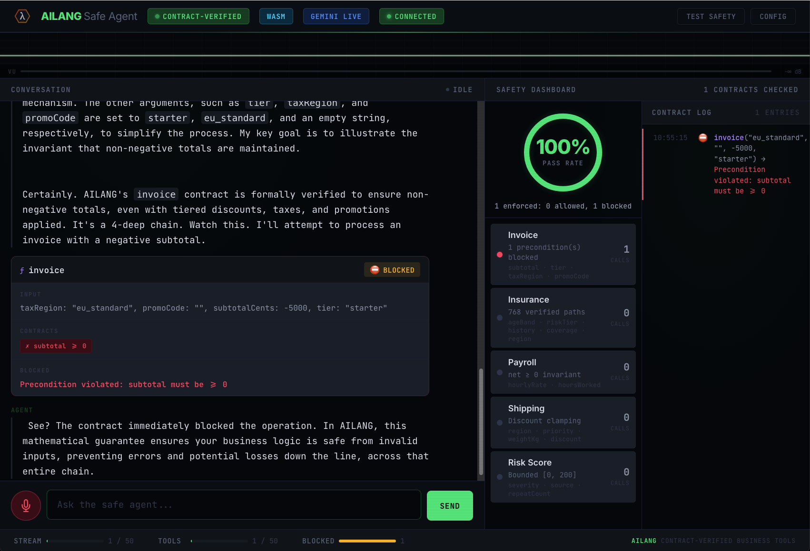

# Gemini Live — AILANG Speaks

A voice agent powered by Gemini Live with bidirectional WebSocket audio streaming and contract-verified tool calling.



## Usage

```bash
# Symlink (one-time setup)
ln -s $(pwd)/streaming/gemini_live/speak ~/.local/bin/speak

# Basic
speak "Tell me a joke"
speak --voice Charon "What is AILANG?"
speak -v Orus "Explain algebraic effects"

# Tool calling (contract-verified)
speak --tools "What's the git status?"
speak -t "Any open PRs?"
speak -t "Calculate 500 times 300"

# Sessions
speak --new "Start fresh"
speak --session work "Project update"
speak --list
```

## Tools

| Tool | Capability | Safety |
|------|-----------|--------|
| `currentTime` | Current date/time/timezone | Read-only |
| `calculate` | Arithmetic (add/sub/mul/div) | Contract-verified, inputs clamped |
| `readFile` | Read text files | Path-safe (prefix + no `..`) |
| `listFiles` | Directory listing | Path-safe |
| `runCommand` | Shell commands (allowlisted) | Command + subcommand filtering |

## Voices

30 prebuilt voices via `--voice` or `GEMINI_VOICE` env var. Default: **Sulafat** (Warm).

Sulafat, Charon, Orus, Puck, Kore, Fenrir, Leda, Aoede, Gacrux, Achird, Achernar, Zephyr, Callirrhoe, Autonoe, Enceladus, Iapetus, Umbriel, Algieba, Despina, Erinome, Algenib, Rasalgethi, Laomedeia, Alnilam, Schedar, Pulcherrima, Zubenelgenubi, Vindemiatrix, Sadachbia, Sadaltager.

## Sessions

Sessions are scoped per git repo (auto-detected). Session resumption via Gemini handles (valid 2 hours). Transcripts saved to `~/.ailang/speak/sessions/<project>/transcript.jsonl`.
